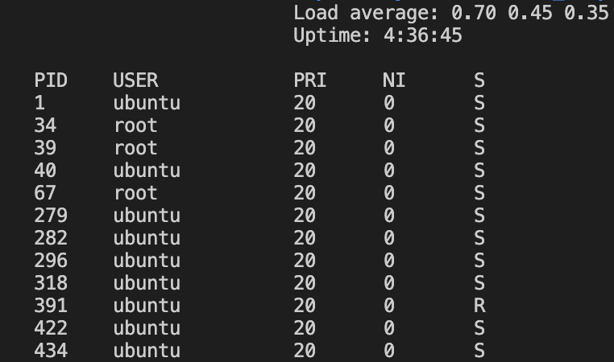

# My mini-htop


A lightweight Linux process monitor written in C/C++

## Features
- Load average
- Uptime
- PID
- User
- Priority (PRI)
- Niceness (NI)
- State (S)

## Screenshot


## Build
```bash
git clone https://github.com/Zinoki12/own_htop
cd own_htop
mkdir build
cd build
cmake..
make
```

## Run
```bash
./mini_htop
```

## Roadmap

### v0.1.0
- [x] Load average
- [x] Uptime
- [x] PID
- [x] User
- [x] Priority 
- [x] Niceness 
- [x] State

### v0.2.0
- [ ] CPU usage
- [ ] Memory usage
- [ ] Virtual memory
- [ ] Res
- [ ] SHR
- [ ] Time+
- [ ] Command
- [ ] Auto refresh
